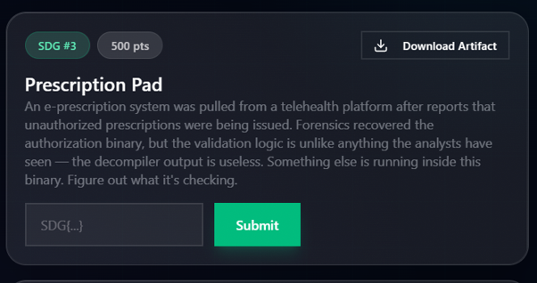
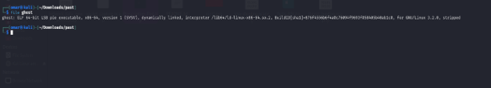
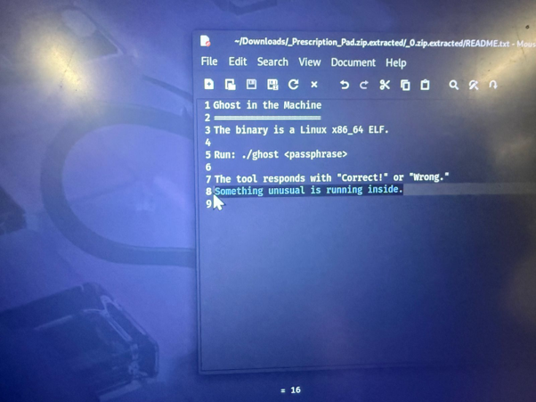
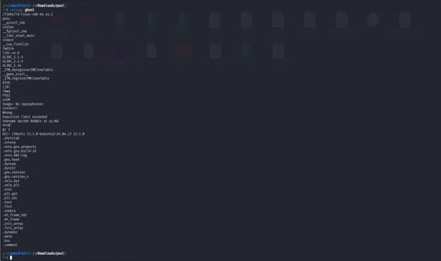
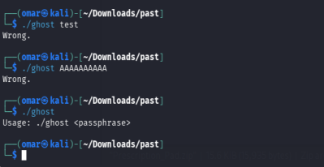
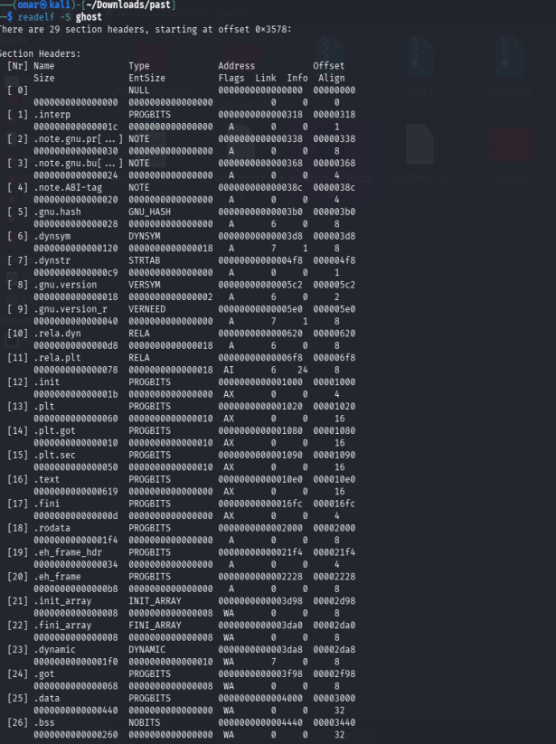
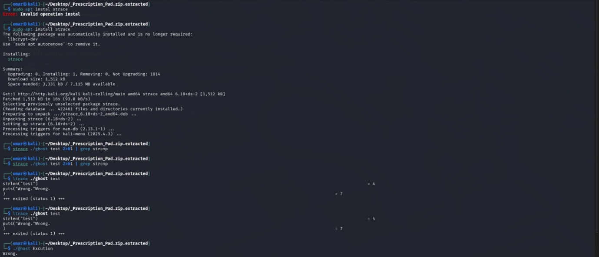
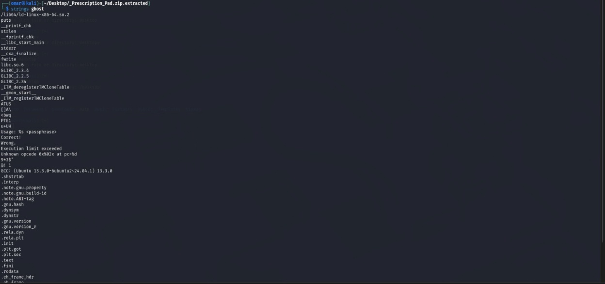

# Prescription Pad

## Competition Information

**Event:** Hack for a Change (March 2026)  
**Category:** Reverse Engineering, Binary Exploitation, Cryptography  
**Difficulty:** High  
**Author:** Omar Ahmed (Cybersecurity Student)


---

# Objective & Challenge Context


The March 2026 edition of Hack for a Change focused on security challenges tied to global health and UN SDG 3. I participated in this event as part of my CTF coursework. After receiving approval from my instructor, Professor Mohd Hanis Jenalis, to ensure the challenge fit within the educational scope, I tackled this challenge independently.

The scenario involved a compromised e-prescription platform releasing fake prescriptions. I was provided with a stripped Linux ELF binary acting as a passphrase checker. The objective was to reverse-engineer the binary, bypass its embedded obfuscation mechanisms, and recover the exact passphrase that produces the output `Correct!`.



---

# Tools Used

- `file` (Binary identification)
- `strings` (Static string extraction)
- Capstone / Disassembler (Static analysis and opcode extraction)
- Python (Emulator and solver scripting)

---

# Investigation & Methodology

## Step 1 - Initial Reconnaissance



The first step in analyzing the binary was identifying its file type and architecture.



```bash
$ file ghost

ghost: ELF 64-bit LSB pie executable, x86-64, version 1 (SYSV),
dynamically linked, stripped
```

### Key Observations

- The binary is a 64-bit ELF executable designed for Linux x86-64.
- It is a Position Independent Executable (PIE), meaning memory addresses shift dynamically during execution.
- The binary is stripped, meaning symbols and debugging information were removed, requiring manual analysis of the program logic.



Extracting readable strings revealed important clues:



```bash
$ strings ghost

Usage: %s <passphrase>
Correct!
Wrong.
Execution limit exceeded
Unknown opcode 0x%02x at pc=%d
```



The presence of `"Unknown opcode"` and `"Execution limit exceeded"` strongly suggested that the binary contained a custom Virtual Machine (VM).

Instead of directly comparing the password using normal x86 instructions, the program processed custom bytecode through an internal interpreter.

---

# Step 2 - Execution Behaviour



Testing the binary with different inputs showed consistent behaviour:

```bash
$ ./ghost test
Wrong.

$ ./ghost AAAAAAAAAA
Wrong.

$ ./ghost
Usage: ./ghost <passphrase>
```

The binary exited normally without crashing or timing out, indicating that the internal VM handled execution correctly.

---

# Step 3 - ELF Structure & Bytecode Location



By analysing the ELF structure and the `.text` section, the VM bytecode location was identified.

Important discoveries:

- **Bytecode Length:** A 32-bit integer at VA `0x4020` indicated a bytecode size of exactly `666` bytes.
- **Bytecode Location:** The bytecode array was stored inside the `.data` section starting at VA `0x4040`.

| Section | File Offset | Size | Purpose |
|---|---|---|---|
| `.text` | `0x10e0` | `0x619` | x86-64 VM interpreter |
| `.rodata` | `0x2000` | `0x1f4` | Strings and jump table |
| `.data` | `0x3000` | `0x440` | VM bytecode (666 bytes) |
| `.bss` | `0x4440` | `0x260` | VM stack and memory |

---

# Step 4 - Virtual Machine Architecture

The internal VM was a stack-based interpreter consisting of:

### Program Counter (PC)

Tracks the current position inside the bytecode and advances after every instruction.

### Stack

A 256-byte stack used for temporary calculations.

Location:

```
.bss section
VA: 0x4480
```

A pointer tracks the current stack position:

```
VA: 0x45a0
```

### Comparison Register

A 32-bit comparison flag stored at:

```
VA: 0x4460
```

This value is updated by equality checks and controls conditional execution.

A step counter prevents infinite execution loops.

---

# Step 5 - Recovering the Instruction Set

The VM dispatcher calculates the jump table index using:

```
(opcode - 0x10)
```

The recovered instructions were:

| Opcode | Instruction | Operation |
|---|---|---|
| `0x10` | PUSH_IMM | Push immediate byte |
| `0x11` | POP | Remove stack value |
| `0x12` | DUP | Duplicate stack value |
| `0x20` | ADD | `(a+b) mod 256` |
| `0x21` | SUB | `(a-b) mod 256` |
| `0x22` | XOR | XOR operation |
| `0x23` | MUL | `(a*b) mod 256` |
| `0x24` | ROL | Rotate left |
| `0x25` | AND | Bitwise AND |
| `0x30` | LOAD_MEM | Load memory value |
| `0x31` | STORE_MEM | Store memory value |
| `0x40` | LOAD_INP | Load input character |
| `0x50` | CMP_EQ | Compare values |
| `0x61` | JMP_IFFALSE | Conditional jump |
| `0x71` | WRONG | Print Wrong |
| `0x72` | CORRECT | Print Correct |

---

# Step 6 - Bytecode Structure & Execution Flow

The 666-byte bytecode performed 37 character checks.

Before validation:

1. Checks that `input[37] == 0` to prevent oversized input.
2. Checks that `input[36] != 0` to enforce the required length.
3. Initializes:

```
mem[0] = 0x5a
```

Each character is transformed mathematically and compared against an expected value.

A failed comparison triggers:

```
WRONG
```

Passing all checks reaches:

```
CORRECT
```

---

# Solution & Inversion Logic

## Transformation Patterns

Four main transformations were identified:

### XOR + ADD

```
(c XOR a) + b = target
```

### MUL + XOR

```
(c * a) XOR b = target
```

### ROL + XOR

```
ROL(c,n) XOR b = target
```

### Accumulator XOR

```
c XOR mem[0] = target
```

Every fifth character also updated the accumulator:

```
mem[0] = (mem[0] + c) mod 256
```

This created a dependency between characters.

---

# Inverting the Constraints

The transformations could be reversed:

```
c = ((target - b) & 0xFF) XOR a
```

```
c = modinv(a,256) * (target XOR b) mod 256
```

```
c = ROR(target XOR b,n)
```

```
c = target XOR mem[0]
```

Using these equations, a Python solver was created to recover the passphrase without brute forcing.

---

# Flag Recovery


The recovered flag was:

```
SDG{48779d457ba0cc966d8eb05e6c4d4d83}
```

---

# Verification

Running the recovered passphrase:

```bash
$ ./ghost "SDG{48779d457ba0cc966d8eb05e6c4d4d83}"

Correct!
```

---

# Lessons Learned

- Custom Virtual Machines can hide program logic and prevent simple debugging approaches.
- Static binary analysis allowed recovery of the VM structure and instruction set.
- Reverse engineering the bytecode revealed that the password checks relied on reversible mathematical operations.
- Creating a custom emulator and solver was more efficient than brute forcing the passphrase.

This challenge demonstrated how analysing program architecture, rather than only searching for vulnerabilities, can reveal hidden verification mechanisms.